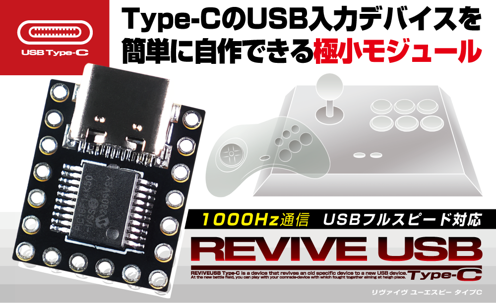

# ADRVUSBC-REVIVE-USB-Type-C

## 弊社ベストセラー製品がUSB Type-C化！Type-CのUSB入力デバイスを簡単に自作できる極小モジュール！REVIVE USB Type-C

『REVIVE USB Type-C』は、簡単にオリジナルUSBデバイスを製作できるモジュールです。
12個のピンにスイッチを接続するだけで、デバイス-PC間のやりとりや設定等、難しい処理を全てこのモジュールが解決します。
従来のRevive USBシリーズの基本仕様を踏襲しつつ、リバーシブルで利便性の高いUSB Type-Cコネクタを採用。
チャタリングの防止やエンコーダ入力対応等の高度な機能も備えています。
オリジナルデバイスの製作やプロトタイピングなどにお役立ちの製品です。
 

## [製品HP](http://bit-trade-one.co.jp/adrvusbc/) 

## [ファイルダウンロード・説明サイト（GitHub）](https://github.com/bit-trade-one/ADRVUSBC-REVIVE-USB-Type-C/)  

## [設定ツール（通常版）使用方法](https://github.com/bit-trade-one/ADRVUSBC-REVIVE-USB-Type-C/blob/main/doc/%E8%A8%AD%E5%AE%9A%E3%83%84%E3%83%BC%E3%83%AB%EF%BC%88%E9%80%9A%E5%B8%B8%E7%89%88%EF%BC%89%E4%BD%BF%E7%94%A8%E6%96%B9%E6%B3%95.pdf)

## [設定ツール（マトリックス版）使用方法](https://github.com/bit-trade-one/ADRVUSBC-REVIVE-USB-Type-C/blob/main/doc/%E8%A8%AD%E5%AE%9A%E3%83%84%E3%83%BC%E3%83%AB%EF%BC%88%E3%83%9E%E3%83%88%E3%83%AA%E3%83%83%E3%82%AF%E3%82%B9%E7%89%88%EF%BC%89%E4%BD%BF%E7%94%A8%E6%96%B9%E6%B3%95.pdf)

## [ファームウェアアップデート](https://github.com/bit-trade-one/ADRVUSBC-REVIVE-USB-Type-C/blob/main/doc/%E3%83%95%E3%82%A1%E3%83%BC%E3%83%A0%E3%82%A6%E3%82%A7%E3%82%A2%E3%82%A2%E3%83%83%E3%83%97%E3%83%87%E3%83%BC%E3%83%88.pdf)

## 製品仕様
    【対応OS】Windows7以降
    【サイズ】W16×D20×H5mm
    【重量】約1g
    【入力点数】12(デジタル)
    【コネクタ】USB Type-C
    【電源】5V (USB Type-C)
    【使用温度】0 ～ 40℃（結露なきこと）
    【保証期間】 1年間
    【付属品】保証書 1部
    【生産国】Made in Japan

## 製品仕様

[「PC Watch」様 / 「簡単にUSB Type-C接続の入力デバイスが自作できるモジュール」]([https://bit-trade-one.co.jp/blog/20190802/](https://pc.watch.impress.co.jp/docs/news/1668429.html)
